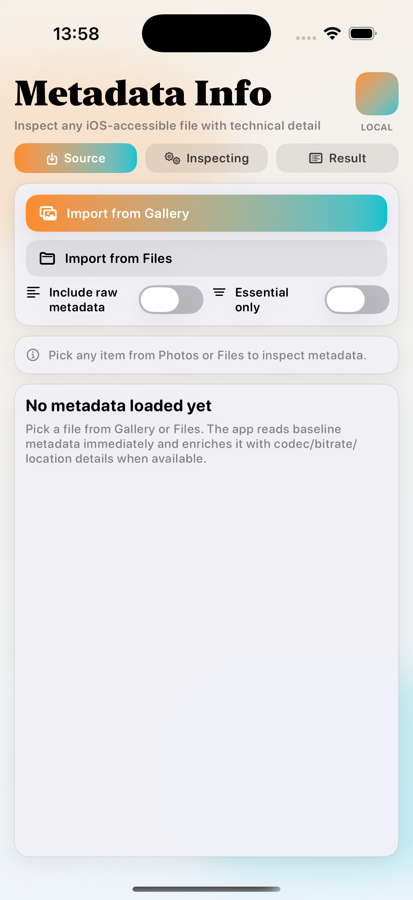
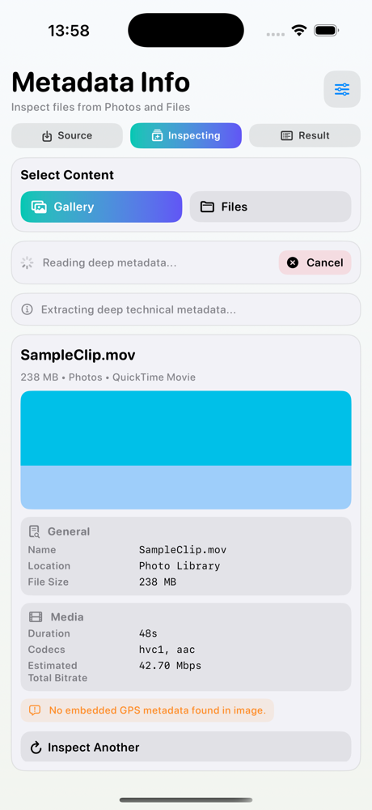
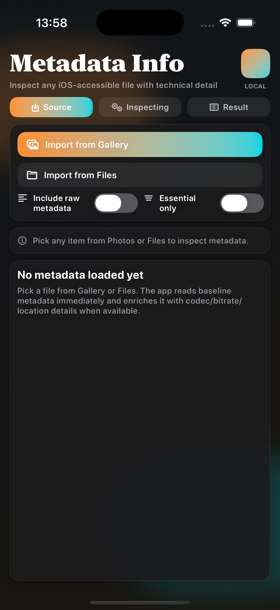
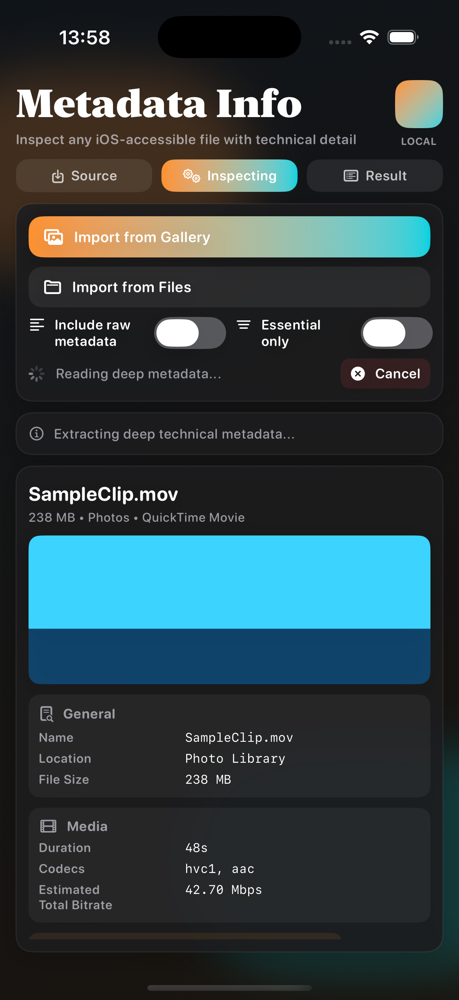
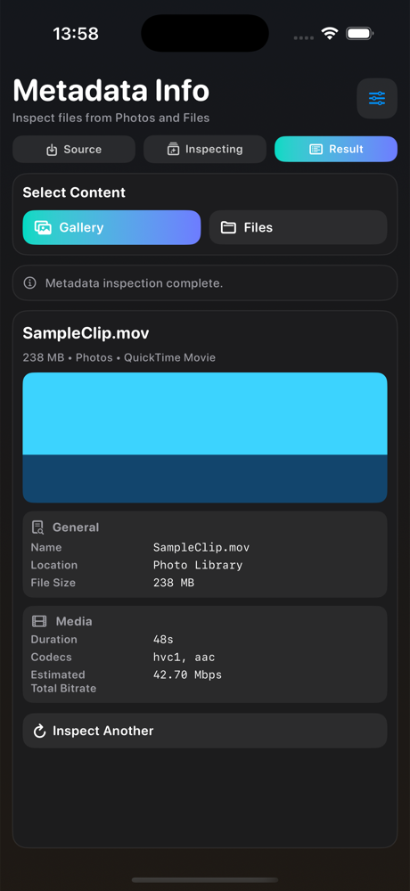
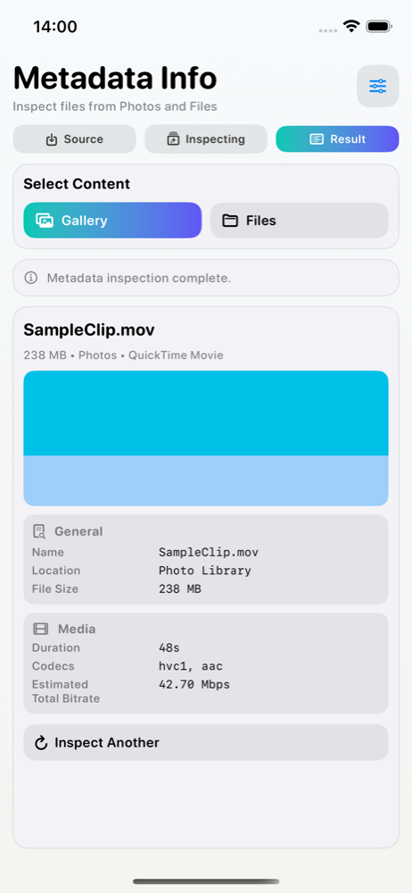
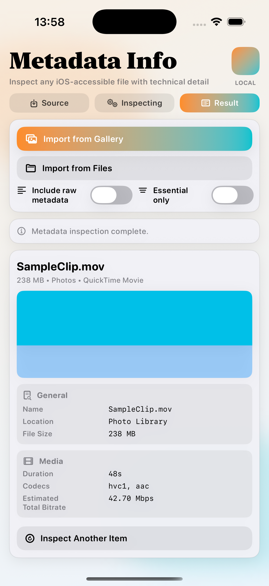
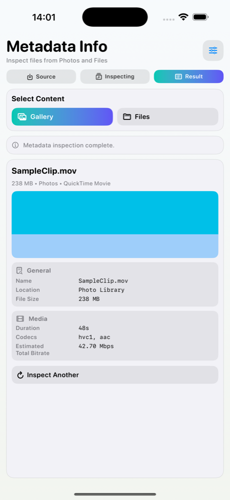

# Metadata Info

Metadata Info is a local-first iOS app that inspects technical metadata for files imported from both Photos and Files.

## Features
- Import from Gallery (Photos) and Files.
- Baseline metadata for any iOS-accessible file type (name, size, location context, type, timestamps).
- Deep metadata enrichment when available:
  - Media: duration, codec, track list, bitrate.
  - Images: dimensions, EXIF/GPS details.
  - PDFs: page count and document attributes.
- Progressive metadata loading with explicit cancel control.
- Light/Dark mode-ready compact UI.

## Showcase

  
  
  

  
  
  

  
  
  

